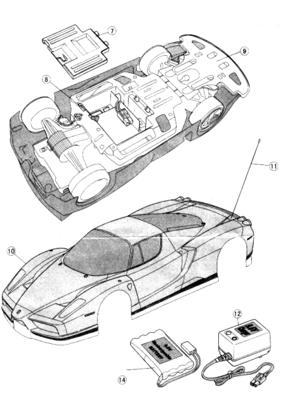

# Ездим и летаем

## На занятии:
1. Знакомство с управляемыми моделями автомобиля и квадрокоптером
2. Правила техники безопасности при работе с моделями 
3. Принципы программного управления моделями 
4. Работа по группам: "дроны", "машинки", потом наоборот.  

## Ход урока:  
### Организационный момент. Активизация учащихся  
Обсудить с учащимися использование ИИ, обученных моделей в современной технике: автономные автомобили, беспилотные летательные аппараты, роботы доставщики.
В данном курсе вам будет предложено применить полученные навыки в мобильных устройствах модели автомобиля и квадрокоптере. 
Прежде чем использовать ИИ в предлагаемых моделях автомобиля и дронах, необходимо ознакомиться с их устройством, принципом действия и программным управлением.

### Знакомство с управляемыми моделями

### Модель автомобиля
Можно выдать учащимся модели автомобилей. 
Здесь необходимо по пунктам рассказать устройство автомобиля из документа [Устройство автомобиля](../Theory/VisionCar_Structure.md).

---
***<u>Слайд 1.</u>*** **Общее описание автомобиля**  
Картинки  
  
  
---
В этот момент можно рассмотреть его внешний вид, и перейти к изучению его устройства

---
***<u>Слайд 2.</u>*** **Устройство автомобиля**  
На слайде картинка  
  
~~Надо будет заменить на актуальное фото~~
---
1. Корпус автомобиля
2. Колеса
3. Батарейный отсек
4. Передние фары
5. Задние фары
6. ...
7. ....

---
***<u>Слайд 3.</u>*** Установка аккумулятора  
  
~~Надо будет заменить на актуальное фото~~
---

Перед началом заездов с помощью отвертки открутите винт на крышке аккумуляторного отсека, потяните защелку и откройте крышку.
Установите заряженный аккумулятор в отсек и соедините разъемы проводов автомобиля и аккумулятора.
Закройте крышку отсека, защелкните и с помощью отвертки закрутите винт.  
*После окончания заездов извлеките аккумулятор.

---
***<u>Слайд 4.</u>*** Включение автомобиля  
  
~~Надо будет заменить на актуальное фото~~
---

Включите питание автомобиля, переведя переключатель питания автомобиля в положение _on_.  
*По окончании заездов не забудьте перевести переключатель в положение _off_ и, если больше не планируете заезды, извлеките аккумулятор.

---
***<u>Слайд 5.</u>*** Настройка рулевых колес  
  
~~Надо будет заменить на актуальное фото~~
---

Если автомобиль не может двигаться по прямой, произведите балансировку при помощи рычага балансировки рулевых колес на днище машины.
Если автомобиль заносит вправо, переведите рычажок в положение _L_, если влево - в положение _R_.

---
***<u>Слайд 6.</u>*** Заряд аккумулятора  
  
~~Надо будет заменить на актуальное фото~~
---

Подсоедините аккумулятор к зарядному устройству и подключите зарядное устройство к порту USB компьютера или блока питания.

---
***<u>Слайд 7.</u>*** Добавление воды в бак генератора пара
~~Нужно сделать фото залива воды в бак.~~  
---

1. Используйте специальную пипетку для залива воды в бак. Не наливайте воду напрямую из-под крана или какой-нибудь посуды. 
2. Добавьте чистую воду из-под крана, чтобы использовать реалистичный эффект дыма.
3. Будьте осторожны, наливайте воду только в бак автомобиля и не проливайте воду на автомобиль, так как это может привести к короткому замыканию.
4. Не используйте функцию пара без воды во избежание поломки. 

### Техника безопасности при работе с моделью автомобиля

---
***<u>Слайд 8.</u>*** **Техника безопасности**
  
---

Познакомившись с устройством автомобиля, необходимо провести инструктаж по технике безопасности.
Для начала можно во фронтальном режиме поспрашивать у учащихся какие они видят требования по безопасности при работе с автомобилем.
Далее необходимо познакомить учащихся с [Инструкцией по технике безопасности](../Theory/VisionCar_SafetyInstruction.md.md).

---
***<u>Слайд 9.</u>*** **Первое включение автомобиля**  
  
---

1. Убедитесь, что переключатель включения находится в положении _off_.
Установите батарею в отсек для батареи, подключите ее к автомобилю и закройте крышку.
2. Удерживая модель на весу, переведите выключатель в положение _on_.
Будьте внимательны, чтобы ваши руки не касались колес модели автомобиля.
~~Колеса автомобиля не на долго прокрутятся. Возможно сделаем индикацию и уберем вращение колес.~~ 
3. После включения модель создаст свою точку доступа сети Wi-Fi _"robot-xxxxxx"_ без пароля.
При подключении вашего компьютера к данной сети в браузере откроется следующая страница:
   1. _Wi-Fi mode_ - режимы 
       1. _Client_ - переходит в режим клиента и можно подключиться к домашней сети (нам нужен этот режим)
       2. _Client with login_ - переходит в режим клиента с аутентификацией
       3. _Access point_ - создает свою точку доступа, к которой можно подключиться
   2. В режиме _Client_ нужно ввести данные домашней сети в поля _SSID_ и _Password_ (введите данные вашей сети)
   3. В режиме _Client with login_ нужно ввести данные .....
   4. В режиме _Access point_ можно ничего не изменять и точка доступа останется по умолчанию _"robot-xxxxxx"_.
   Можно придумать и ввести данные в поля _SSID_ и _Password_ (необходимо их запомнить).
4. После ввода данных сети нажать кнопку _Set_, появится сообщение, требующее подтверждение действий и, после подтверждения, робот перезагрузится с настройками сети, которые вы установили.

Каждый ученик должен запомнить автомобиль, с которым работает.
В течении обучения по программе удобнее всего будет использовать один и тот же автомобиль.

### Квадрокоптер
Здесь необходимо рассказать об устройстве квадрокоптера, принципах его работы.

---
***<u>Слайд 10.</u>*** **Общее описание квадрокоптера**  
  
---

Квадрокоптер поддерживает набор средств разработки с возможностью подключения к компьютеру посредством Wi-Fi и выполнения текстовых команд, отправленных пользователем.
Использование этих команд позволяет:
- включать и выключать распознавание полетных меток в полете;
- заставлять квадрокоптер взлетать, садиться;
- включать и отключать получение потокового видео с фронтальной камеры;
- аварийно отключать моторы;
- в ответ на команды отправлять на устройство информационные сообщения, такие как:
    - текущая скорость;
    - текущий заряд батареи;
    - текущее время полета;
    - серийный номер квадрокоптера.

---
***<u>Слайд 11.</u>*** **Устройство квадрокоптера**  
  
---

Здесь можно рассказать не только об устройстве квадракоптера, но и о его принципе действия, если времени будет достаточно. 
Подробнее о работе дрона можно почитать в документе [Устройство и принцип работы квадрокоптера](../Theory/TelloTalent_Structure.md).    

---
***<u>Слайд 12.</u>*** **Установка аккумулятора**  
  
---

Вставьте полетный аккумулятор в квадрокоптер, как показано на рисунке.
Убедитесь, что аккумулятор надежно закреплен.

Чтобы снять аккумулятор, выньте его из квадрокоптера.

---
***<u>Слайд 13.</u>*** **Включение квадрокоптера**  
  
---

Перед началом полетов выполните пункты инструкции по безопасности перед полетом.

Далее вставьте полетную батарею в квадрокоптер, убедитесь, что батарея надежно закреплена.

Нажмите на кнопку включения: индикатор состояния дрона вначале будет перемигиваться красным, зеленым, желтым – режим самодиагностики.
Далее индикатор начнет быстро мигать желтым – нет соединения.

Квадрокоптер создаст свою точку доступа сети Wi-Fi. 
Для подключения к квадрокоптеру и управления им необходимо подключиться созданной сети «TELLO-XXXXXX» (данная сеть без пароля). После подключения индикатор квадракоптера продолжит быстро мигать желтым до запуска программы.

После запуска программы индикатор начнет медленно мигать фиолетовым цветом – подключен и к нему поступают команды.
Если команды не поступают более 15 секунд, индикатор начинает мигать быстро фиолетовым цветом.

---
***<u>Слайд 14.</u>*** **Техника безопасности**  
  
---

Ознакомить учащихся с [инструкцией по технике безопасности](../Theory/TelloTalent_SafetyInstruction.md).

### Техника безопасности при работе с квадрокоптером
Подключение к квадрокоптеру

### Работа по группам
*Если группа не большая, рекомендуется сначала всем вместе запускать машинки, потом квадрокоптеры.
Если группа большая, то разделиться на две группы.*

#### Работа с автомобилем
Здесь можно ознакомиться с [базовыми командами](../Theory/VisionCar_BasicCommands.md) управления автомобилем.

Пример работы с машинкой: движение вперед/назад, повороты влево/вправо, управление периферией (освещение переднее/заднее, пар)

Задания:
1. Запустить пример включения видеопотока, контроль заряда батареи.
   1. Добавить управление освещением, парогенератором
2. Проехать из точки *a* в точку *b*
3. Проехать по замкнутому контуру (вернуться в исходную точку)
4. Прописать маршрут с объездом препятствий 

#### Работа с квадрокоптером
Здесь можно ознакомиться с [базовыми командами](../Theory/TelloTalent_BasicCommands.md) управления квадрокоптером.

Пример работы с квадрокоптером: взлет/посадка, повороты вправо/влево, перемещение вперед/назад, вправо/влево
1. Запустить пример включения видеопотока, контроль заряда батареи
   1. Вывести на экран значение текущей температуры, значения гироскопа
2. Пролететь из точки *a* в точку *b*
3. Пролететь по замкнутому контуру (вернуться в исходную точку)
4. Прописать маршрут для пролета через ворота